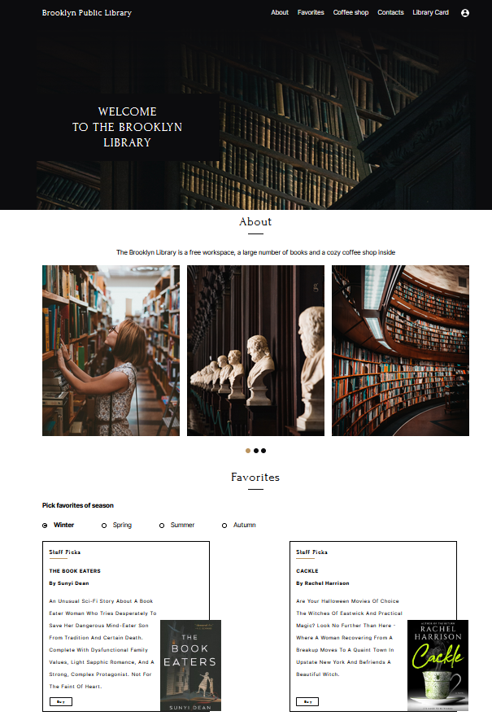

# Personal project «The Brooklyn Library»

* A layout is adaptive for desktop (**1440px**) and tablet (**768px**)
* Responsive from **640px** to **1440px** and more
* The project was made in school's private repository and just copied here, that's the reason of small amount of commits

----
* Adaptive menu set up

